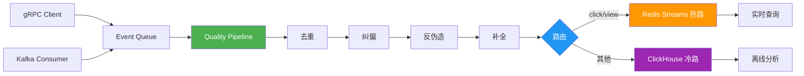

# event_stream_engine

**简体中文** | [English](./README_en.md)

> 日均处理百万级事件，脏数据零容忍 — Quality Pipeline 四阶段过滤 + Lambda 架构分流，P99 延迟 5.4ms。

实时事件流处理引擎。从 gRPC/Kafka 接收事件，经过 Quality Pipeline 四阶段质量过滤后，通过 Lambda 架构分流至 Redis Streams（实时）和 ClickHouse（离线）。

## 功能特性

- **双通道接入** — 同时支持 gRPC（SendEvent/SendBatch）和 Kafka 消费者
- **有界队列** — 线程安全阻塞队列（默认容量 10000），mutex + condition_variable 背压控制
- **Quality Pipeline 四阶段质量过滤**：去重 → 纠偏 → 反伪造 → 补全
- **Lambda 架构分流** — click/view 走热路（Redis Streams），其他走冷路（ClickHouse 批量写入）
- **熔断器** — 可配置失败阈值、超时时间、半开状态探测
- **租户路由** — 一致性哈希，支持多租户隔离

## 架构



## 技术栈

C++17, gRPC, Protobuf, Kafka, Redis, ClickHouse, OpenSSL, spdlog, CMake

## 快速开始

### Docker（推荐）

```bash
git clone https://github.com/happiness-cheng/event_stream_engine.git
cd event_stream_engine
docker compose up -d
```

### 手动编译

```bash
# 安装依赖（Ubuntu/Debian）
sudo apt install -y build-essential cmake libgrpc++-dev protobuf-compiler \
    librdkafka-dev libhiredis-dev libssl-dev libboost-all-dev

git clone https://github.com/happiness-cheng/event_stream_engine.git
cd event_stream_engine
mkdir build && cd build && cmake .. && make -j$(nproc)
./engine
```

## Quality Pipeline

| 阶段 | 功能 | 拒绝条件 |
|------|------|----------|
| 去重 | Redis SET / 内存滑动窗口 | 重复 event_id |
| 纠偏 | Watermark 中位数 +/- 1 小时 | 时间戳偏差过大 |
| 反伪造 | HMAC-SHA256 签名验证 | 签名不匹配 |
| 补全 | GeoIP 字段补全 | 不拒绝，仅补全 |

## 性能数据

| 事件数 | 线程 | QPS | P50 | P99 | 成功率 |
|--------|------|------|------|------|--------|
| 10,000 | 50 | 9,955 | 2.5ms | 5.4ms | 100% |
| 100,000 | 100 | 6,661 | 7.0ms | 52.6ms | 100% |

详见 [tests/PERFORMANCE_REPORT.md](tests/PERFORMANCE_REPORT.md)

## 测试

```bash
./test_queue      # 队列测试
./test_pipeline   # Pipeline 测试
```

## License

MIT
